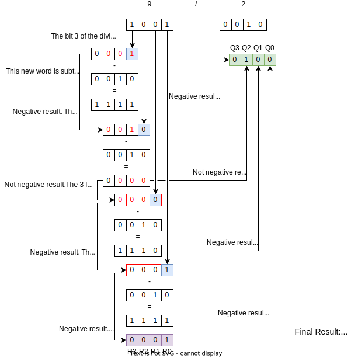

# Fast Divider

This component performs the division operation of two integer 16-bit numbers.

## Example 

The following example uses 4-bit words, but the same method is applicable to words that have more bits.

To do this operarion using negative numbers, it is necessary to complement the negative inputs before performing that. Once done, complement the quotient value according to the signal of the inputs (same signals - not negative quotient - do not complement | different signals - negative quotient - complement). The signal of the remainder value must be the same of the dividend input.

## Structure

