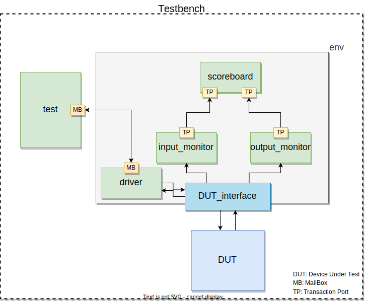

# Testbench

This oriented object testnebch inserts stimulus in the device under test (DUT) and checks the results automatically.  

## Structure

Here: 
 - **DUT_interface** connects the DUT to the testbench environment (**env**);
 - **driver** sends stimulus provided by the **test** to the **interface** to be inserted in the **DUT** and obtains its output signals;
 - **test** contains the stimulus to be verified. It can use the output signals from the **DUT** to change the stimulus sequence/values;
 - **input_monitor** and **output_monitor** read the input and the output signals respectively and send that values to the **scoreboard**;
 - **scoreboard** receives the input signals, defines the expected output signals, compares them to the **DUT** output signals and shows if that values are correct or not.

 **OBS.:** *The testbench results can be seen in the testbench_output.txt file.*