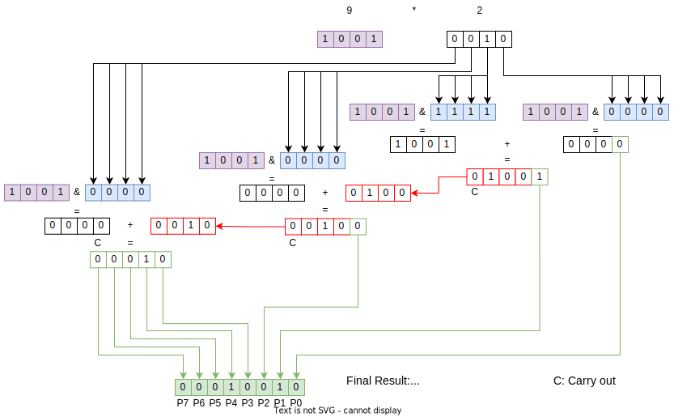

# Fast Multiplicator

This component performs the multiplication of two 16-bit numbers and returns a 32-bit result. 

## Example

The following example uses 4-bit words, but the same method is applicable to words that have more bits.

To do this operarion using negative numbers, it is necessary to complement the negative inputs before performing that. Once done, complement the product value according to the signal of the inputs (same signals - not negative product - do not complement | different signals - negative product - complement).